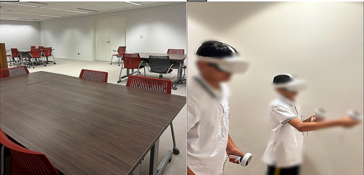
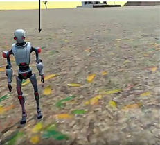
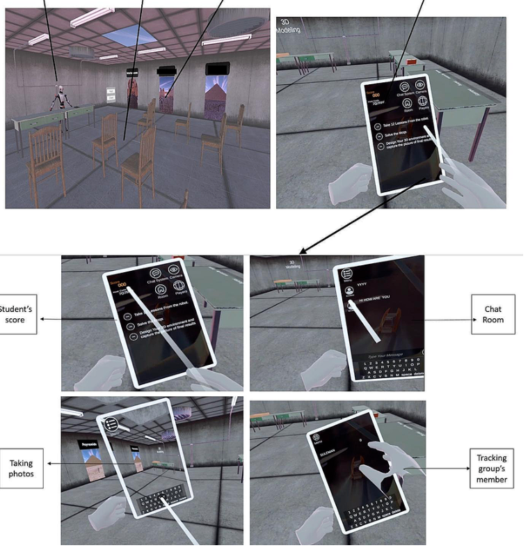
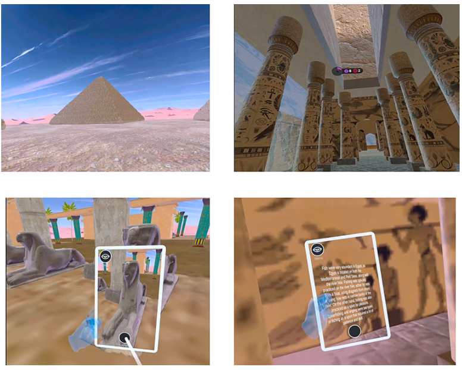
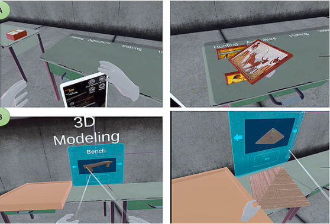

*Ancient Egyptian civilization. Seventh grade students. Meta Quest 2 headsets. And eventually — a peer-reviewed journal.*

---

## The Brief That Arrived From Kuwait

This one started differently.

A researcher and educator at **Kuwait University** came to us with a social studies problem. Her 7th grade students were learning about Ancient Egyptian Civilization. Standard curriculum. Textbooks, PowerPoints, video clips — the usual toolkit.

It wasn't landing.

History is hard to teach because it's invisible. You can show students a photo of the pyramids. You can describe what life was like along the Nile. But the gap between a 12-year-old sitting in a classroom in Kuwait and Ancient Egypt is not just geographical — it's thousands of years wide.

She wanted to close that gap.

Not with a better video. With an actual world students could walk into.

That's where we came in.

---

## What the Project Had to Do

The scope was serious. A fully immersive IVR field trip through **Ancient Egyptian Civilization (AEC)** — six lessons, 45 minutes each, delivered via **Meta Quest 2 HMDs** to 7th grade students.

Each lesson had to cover a distinct aspect of AEC life:
- The civilization's appearance and geography
- Economic life — how people lived and survived
- Culture and religion
- Science, medicine, and invention
- A final 3D model-building activity where students construct their own version of what they'd seen

Every lesson had to include an intelligent robot guide, a virtual tablet for students to take notes and answer questions, real-time teacher monitoring, and checkpoint assessments with immediate feedback.

It had to align with **Kuwait's Ministry of Education curriculum**. Exactly. Not approximately.

And it had to work on a class of 24 students simultaneously — all in headsets, all in the same virtual world, all moving through the same experience together.

Simple to say. A lot to build.

---

## Why VR for History Specifically?

People ask this more for history than for any other subject.

The intuition makes sense — history is facts and dates, why do you need immersion? But that intuition gets it backwards. History is hard to teach precisely *because* it can't be observed. You can't take students to Ancient Egypt. You can't show them what the Nile looked like 3,000 years ago. You're always working through a layer of abstraction.

VR removes that layer.

When a student physically walks through a virtual recreation of an Egyptian city — sees the architecture, examines the paintings on pyramid walls, handles 3D artifacts — the information stops being abstract. It becomes spatial. Contextual. Memorable.

The research backs this up. Students who learn through immersive VR consistently show higher academic achievement and lower cognitive load than students covering identical content through traditional methods. Not slightly higher. Significantly.

We built this project knowing that. The goal was never to make a flashy tech demo. It was to build something that would genuinely help 12-year-olds understand a civilization they'd never been able to see.

---

## The World We Built

### The Intelligent Robot Guide

Before anything else — the robot.

Every lesson is anchored by an **intelligent robot guide** that greets students in the virtual classroom, explains what they're about to explore, and travels with them through each scene. Same principle as GAIA in our Climate VR project — an AI companion that sets context, explains what students are seeing, and prompts them to think rather than just observe.

The robot doesn't just narrate. It reveals the four "magic doors" in the virtual classroom — one per lesson — that lead students into each aspect of AEC life. It's a narrative device that makes the structure feel like exploration, not instruction.

Each student also receives a **virtual tablet** they carry throughout the field trip — for taking notes, answering checkpoint questions, taking pictures of discoveries, and displaying information about objects they find.

---

### Lesson 1 — Introduction to Ancient Egypt

The first magic door opens into Ancient Egypt itself.

The robot briefly orients students — here's what you're about to see, here's what you should be looking for — then reveals a map with three locations to explore in sequence.

**Location 1** — an urban environment. Students roam freely with their robot guide, observing how the city was laid out, what buildings looked like, how people moved through the space.

**Location 2** — inside a pyramid. Prominent paintings line the walls depicting AEC history. Students examine them closely, gathering information embedded in knowledge items that appear when they approach each painting.

**Location 3** — outside the pyramids. Students get a sense of scale, of the engineering achievement these structures represent, of the civilization that built them.

Students spend roughly 15 minutes in these spaces — gathering facts like construction dates, names, and locations — before returning to the virtual classroom where the robot presents multiple-choice questions on their tablet and gives immediate feedback.

---

### Lesson 2 — Economic Life

The second door opens into a landscape of pyramids and economic activity.

Students study the structures and examine 3D objects they can pick up and manipulate. Paintings on the walls show how Ancient Egyptians lived — how they dressed, what they hunted, which crops they grew, what animals mattered to their economy.

The robot guides students through each discovery, adding context. Knowledge items embedded in the environment reveal additional detail when approached. After the tour, back in the virtual classroom — more checkpoint questions, more immediate feedback.

---

### Lessons 3 & 4 — Culture, Religion, Science & Invention

<!-- INSERT SCREENSHOT: Virtual artifacts — mummy case, medicine tools, calendar — displayed as 3D objects students can examine -->

These lessons follow the same structure with richer content.

Culture and religion — students explore AEC beliefs, rituals, and cultural practices represented through the environment and its artifacts. Science and invention — mummification methods, medicine, agriculture, engineering. The same civilization, seen from a different angle each time.

Each lesson is its own scene behind its own magic door. The virtual classroom is the constant — the home base students return to after each excursion for reflection and assessment.

---

### The Final Lesson — Classification & 3D Model Building

The last lesson is the most ambitious — and the one I think demonstrates what collaborative VR can actually do.

**Activity 1 — Classification.** The virtual classroom table displays four category titles: Religion, Culture, Invention, Science & Economic Life. Then a collection of 3D objects: mummies, boats, fish, the AEC calendar, medicine tools, wigs, makeup. Students work together — communicating through VR audio — to classify each object into the right category. They argue. They negotiate. They explain their reasoning to each other in the headsets.

**Activity 2 — 3D Model Building.** Students recreate a 3D environment similar to what they explored during the field trip. Then each group presents — explaining how and why they classified each object, and walking the class through their model.

The teacher watched all of this happen in real time through a tablet interface connected to the Unity application. She could see student progress, monitor where they were in the virtual environment, and control scene entry across all 24 headsets simultaneously.

---

## The Teacher Dashboard

<!-- INSERT SCREENSHOT: Teacher tablet interface showing student positions in virtual environment, progress indicators -->

The teacher's experience was as carefully designed as the students'.

She wasn't just watching. She was facilitating — moving between groups, answering questions in person, guiding students through the virtual environment while two assistants helped manage physical safety (ensuring no one walked into a wall).

The Unity app gave her real-time visibility into every student's progress. After each lesson, she had checkpoint scores and response data across the full class. At the end of the unit — a complete picture of what every student understood, and what they didn't.

That data capability matters enormously. Assessment built into the world, invisible to students, powerful for the educator.

---

## What Happened Next

The experiment ran for six weeks. January 2023. Three 45-minute classes per week.

48 seventh-grade students — 24 in the VR group, 24 in a control group covering identical content through traditional methods: PowerPoint, textbooks, video clips, worksheets.

Same teacher. Same curriculum. Same assessment tools. The only difference was the experience itself.

The results were significant.

The VR group achieved **meaningfully higher academic performance** on post-course assessments. They also showed **significantly lower cognitive load** — less mental effort required to process and retain the same information. And on the multimodal presence scale, they scored high across all three dimensions: physical presence, social presence, and self-presence.

Put simply: students felt like they were actually there. And because they felt that, they learned more.

---

## It Ended Up in a Peer-Reviewed Journal

In 2024, the researchers published their findings in **Education and Information Technologies** — a Springer journal — under the title *"The effects of immersive virtual reality field trips upon student academic achievement, cognitive load, and multimodal presence in a social studies educational context."*

I didn't know this was coming. No one told me they were writing a paper.

Then one day I found the published study — and scrolled to the acknowledgements section at the end. Here's what it says, word for word:

> *"We would like to acknowledge the invaluable contributions of Suliman Khan, a software engineer, for his role in developing our VR application and tackling technical challenges throughout the experiment. His expertise and dedication greatly enhanced the quality and success of our research, and we are deeply grateful for his contributions."*

Suliman Khan is me — **Syed Suleman Shah**, CTO of WitShells Studio. She got my name slightly wrong. I'll take it.

A piece of software I built in 2023 became **empirical evidence** in a peer-reviewed academic paper published by Springer. The system I designed — the intelligent robot guide, the virtual tablet, the checkpoint mechanics, the real-time teacher dashboard — was used as a research instrument to measure how well immersive VR teaches history to middle school students.

The answer the paper found: **significantly better than everything that came before it.**

That acknowledgement sits permanently in a published journal. It doesn't go anywhere.

You can read the full study here: [Education and Information Technologies, Springer (2024)](https://doi.org/10.1007/s10639-024-12682-3)

---

## What This Project Taught Me

### 1. History is the perfect subject for VR — not the obvious one
Everyone assumes science or geography. But history has the biggest gap between what students need to understand and what traditional tools can show them. VR closes that gap better than anything else.

### 2. The robot guide is not a nice-to-have
We built a similar guide in our Climate VR project (GAIA) and the same principle applied here. Students need an anchor in an unfamiliar environment. Without it, the experience becomes overwhelming rather than educational. The robot is the pedagogy, not the decoration.

### 3. Collaborative mechanics transform the assessment
The classification activity in the final lesson produced more genuine learning evidence than any written test. Students had to argue their reasoning in real time, with peers, in the headset. That's assessment as it should work — embedded in the task, not bolted on afterward.

### 4. Teacher visibility is non-negotiable
The teacher's tablet interface — monitoring all 24 students in real time — was what made this scalable. A teacher who can't see what students are doing inside a headset cannot facilitate effectively. We built the monitoring layer first, not last.

### 5. When your client publishes their findings — you get cited in a journal
This one I didn't plan for. But it changed how I think about the work. Every educational VR project we deliver could become research. Build it like it will be.

---

## The Result

A fully deployed immersive VR education system — six lessons, 24 simultaneous students, Meta Quest 2, real-time teacher monitoring, checkpoint assessment, collaborative final activities — built for and validated by a structured academic study at **Kuwait University**.

And now documented in a peer-reviewed journal as evidence that immersive VR genuinely improves student outcomes in social studies education.

Not a prototype. Not a pilot. A research-grade educational system that worked.

---

## Thinking About a Similar Project?

If you're a researcher, educator, or institution exploring immersive learning — we've done this before. We know how to build VR experiences that aren't just engaging but are rigorous enough to be used as research instruments.

We build educational VR for:

🔹 **Universities and research institutions** — curriculum-aligned, assessment-integrated, dashboard-enabled  
🔹 **International schools** — IB, Cambridge, MOE-aligned content  
🔹 **Government education ministries** — scalable systems for classroom deployment  
🔹 **EdTech platforms** — licensable, customizable immersive content  
🔹 **NGOs and awareness programs** — immersive experiences that change how people think  

Every project is built to your curriculum, your students, your goals. We're also open to licensing existing projects — including this one and our Climate Change VR — with full customization for your institution, language, or branding.

**Reach out directly. No forms, no funnels.**

📩 [sayedsulaiman607@gmail.com](mailto:sayedsulaiman607@gmail.com) · [cto@witshells.com](mailto:cto@witshells.com)  
💬 [WhatsApp Me →](https://wa.me/923093023289)

---

**Tags:** *VR Education, Ancient Egypt VR, Immersive Learning, EdTech, Unity 3D, Educational Simulation, Meta Quest 2, Social Studies VR, Kuwait University, Peer-Reviewed EdTech, IVR Field Trip, History Education VR*

---

### About the Author

**Syed Suleman Shah** is CTO of WitShells Studio — a VR and interactive experience studio delivering immersive environments for education, defense, and enterprise clients across Pakistan and the Middle East.

*© 2026 WitShells Studio (SMC-Private) Limited. All rights reserved.*